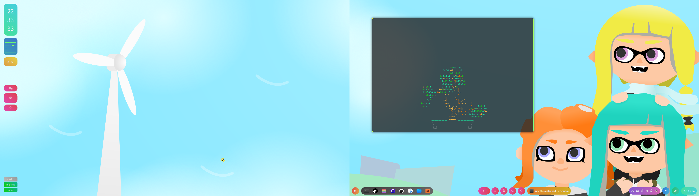
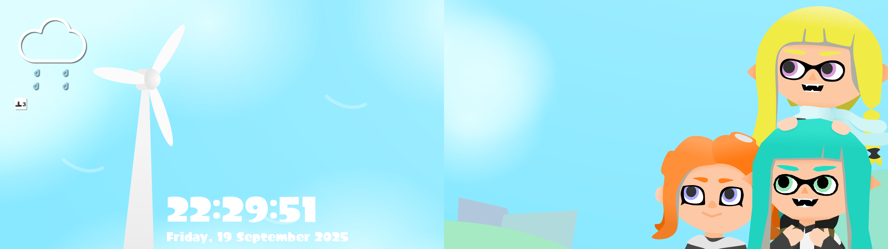

# NiriSquid!
My colorful dotfiles for Niri on my desktop  
(My monitors are still diagonal)
### Desktop

### Lockscreen

## Usage
1. `git clone` this repository
2. Install all dependencies in `PKGBUILD`
	- You can run `makepkg -si`
	- If you are not using an Arch-based distro, just install everything under `depends` and `optdepends` in `PKGBUILD`
3. Create all symbolic links
	- `mako/` -> `~/.config/mako/`
	- `niri/` -> `~/.config/niri/`
	- `waybar/` -> `~/.config/waybar`
	- `applications.menu` -> `~/.config/menus/applications.menu`
4. Install funny fonts. Used for `mako` notifications, `fuzzel` app launcher and `hyprlock` lockscreen
	- [`Nin-SplatoonSorder`](https://github.com/Double-u-G/Splatoon3-Side-Order-Font): A very well made extension to the Side Order fonts
	- [`FOT-Kurokane Std`](https://github.com/North-West-Wind/splatoon3-fonts/blob/main/Decrypted/FOT-KurokaneStd-EB.otf): Font from Splatoon used for fallback for the Side Order font
	- [`AsiaKERIN-M`](https://github.com/North-West-Wind/splatoon3-fonts/blob/main/Decrypted/AsiaKERIN-M.otf): The fallback fallback (yes, 2 fallbacks) font for CJK characters